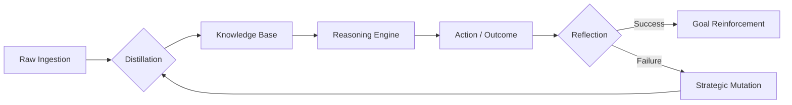

# NOORMME: The Agentic Data Engine

**NOORMME** is a sovereign persistence layer and cognitive operating system designed for **Autonomous AI Agents**. It transcends legacy ORM patterns by providing a self-healing, evolutionary data infrastructure that functions as a high-fidelity extension of the agent's internal reasoning loop.

[](https://www.npmjs.com/package/noormme)
[](https://opensource.org/licenses/Apache-2.0)
[](./docs/agentic-intelligence.md)
[](./docs/ultra-scale-orchestration.md)

---

## 🧠 The Cognitive Loop

NOORMME implements a closed-loop system where data is not merely "stored" but continuously distilled, questioned, and evolved. It turns your database into a living world model.



### ✨ Advanced Orchestration
- **🎭 Tiered Model Routing**: Optimize cost/performance by routing batch discovery to **Fast LLMs** and mutation logic to **Premium LLMs**.
- **🔥 Predictive Pre-warming**: Background AI optimization of skills nearing promotion to eliminate cold-start latency.
- **🌐 Goal Cross-Pollination**: Breakthroughs in individual persona mutations are automatically distilled into global **Systemic Best-Practices**.
- **🌸 Bloom Filter Heuristics**: Ultra-scale knowledge de-duplication at 100x speed vs traditional DB hits.

---

## 🧬 Evolutionary Infrastructure (DNA Inversion)

NOORMME allows agents to autonomously mutate their own structural DNA while maintaining 100% safety.

- **Dynamic DDL**: Agents can propose `CREATE TABLE`, `ADD COLUMN`, or `CREATE INDEX` mutations via the **Evolutionary Pilot**.
- **Structural Rollback**: The **DNA Inverter** automatically generates inverse SQL for any DDL mutation to ensure safe structural experimentation.
- **Meta-Meta Evolution**: A self-tuning system that modulates its own **Mutation Aggressiveness** and **Verification Windows** based on systemic success rates.

---

## 🚥 Autonomous Governance

- **Self-Healing Indexing**: Proactively applies performance indexes based on the agent's own observation of "slow" query contexts.
- **Conflict Resolution**: Scans cognitive rules for semantic overlaps and logical contradictions.
- **Zombie Pruning**: Automatically identifies and removes deprecated or unused knowledge items.
- **Z-Score Sensitivity**: Monitors for performance collapse (latency or success rate) and triggers emergency rollbacks.

---

## 🚀 Getting Started

### 1. Provision the Mind
Initialize your database with a single line to provision 25+ agentic tables for goals, knowledge, episodes, and logic probes.

```typescript
import { NOORMME } from 'noormme';

const db = new NOORMME({
  dialect: 'sqlite',
  connection: { database: './mind.sqlite' },
  agentic: {
    llm: primaryModel,
    llmFast: gpt4oMini,     // For high-throughput batching
    llmPremium: claude35,  // For complex mutations
    enableSelfEvolution: true
  }
});

await db.initialize();
```

### 2. Strategic Interaction
```typescript
const cortex = db.agent.cortex;

// Execute background rituals (Compression, Pruning, Evolution)
await cortex.rituals.runPendingRituals();

// Challenge existing knowledge with new evidence
await cortex.knowledge.challengeKnowledge('SystemArch', 'New audit results.', 0.95);
```

---

## 🗄 Dialect Power Matrix

| Feature | SQLite (Edge) | PostgreSQL (Enterprise) |
| :--- | :--- | :--- |
| **Search** | `sqlite-vss` / Fallback | `pgvector` / FTS |
| **Logic** | In-Process Atomicity | Multi-Tenant Governance |
| **Evolution** | Sequential Snapshotting | Clustered Mutation |
| **Throughput** | Sequential Direct | Bloom-Heuristic Parallel |

---

## 📚 Explore the Documentation
Dive into our deep-dive guides to unlock the full potential of NOORMME:

- [**Ultra-Scale Orchestration**](./docs/ultra-scale-orchestration.md)
- [**Strategic Evolution Guides**](./docs/strategic-evolution.md)
- [**Skill Lifecycle & DNA**](./docs/skill-lifecycle.md)
- [**Sovereign Meta-Evolution**](./docs/meta-evolution.md)
- [**Agentic Intelligence Deep-Dive**](./docs/agentic-intelligence.md)

---

## 🤝 Community & Contribution
NOORMME is an Apache 2.0 open-source project. We invite AI researchers and data engineers to contribute to the future of autonomous persistence.

[Contribution Guide](CONTRIBUTING.md) | [Security Audit](SECURITY.md)

*Transforming passive records into sovereign intelligence.*