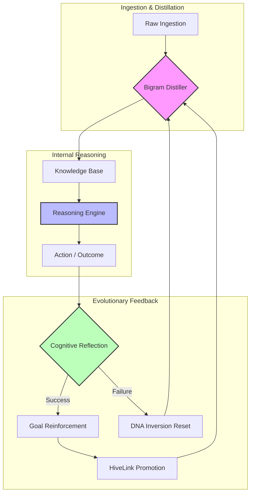

# NOORMME: The Sovereign Agentic Data Engine

**NOORMME** is a sovereign persistence layer and cognitive operating system purpose-built for **Autonomous AI Agents**. It transcends legacy ORM patterns by providing a self-healing, evolutionary data infrastructure that functions as a high-fidelity extension of an agent's internal reasoning loop.

[](https://www.npmjs.com/package/noormme)
[](https://opensource.org/licenses/Apache-2.0)
[](./docs/postgresql/POSTGRESQL_SUPPORT.md)
[](./docs/agentic-intelligence.md)
[](./docs/ultra-scale-orchestration.md)

---

## 🏛️ The Sovereign Triad

NOORMME is built on three architectural pillars that enable agents to move beyond simple storage into true cognitive autonomy.

### 1. 🧠 Cognitive Governance
Turn your passive database into a living world model. NOORMME implements a closed-loop system where data is distilled, questioned, and evolved.
- **Semantic Similarity**: Bigram engine for conflict detection.
- **Curiosity Engine**: Bridges factual gaps and identifies anomalies.
- **HiveLink**: Promotes local insights to global system wisdom.

### 2. 🧬 Evolutionary DNA
Allow agents to autonomously mutate their own structural DNA while maintaining 100% safety.
- **DNA Inversion**: Automatically generates inverse SQL for all autonomous DDL changes.
- **Self-Healing Indexing**: Proactively optimizes schema based on observed query contexts.
- **Strategic Mutation**: Sequential evolution loops with autonomous safety rollbacks.

### 3. 🚀 Ultra-Scale Orchestration
Handle massive agentic workloads with high-throughput intelligence.
- **Tiered Model Routing**: Route batch tasks to Fast LLMs and reasoning to Premium LLMs.
- **Predictive Pre-warming**: Eliminates latency by optimizing skills in the background.
- **Bloom Heuristics**: 100x faster fact de-duplication at the ingestion layer.

---

## 🛸 The Agentic Kubernetes: Swarm Governance

NOORMME functions as a **distributed orchestration layer** for agents. While traditional K8s manages containers, NOORMME manages **cognitive workloads**, ensuring that behaviors learned by one agent can be safely adopted by the entire swarm.

### 🐝 Emergent Swarm Intelligence
- **Collective Intelligence (HiveLink)**: Locally discovered insights are promoted to global system wisdom via high-confidence broadcasting.
- **Skill Synthesis**: Agents autonomously analyze failure telemetry to synthesize new capabilities, which are then peer-reviewed by the swarm.
- **Behavioral Adoption**: High-performing "Verified" skills are propagated across all agent personas, while "Blacklisted" failure modes are suppressed globally.

### 🛡️ Autonomous Governance
- **The Soul-Searching Loop**: A continuous background ritual where the system audits its own health, runs self-probes, and prunes low-utility data.
- **Panic Checks & Containment**: Real-time monitoring of budgets, success rates, and integrity. If a persona breaches safety floors, NOORMME triggers **Emergency Containment** (autonomous rollback).
- **Integrity Floor**: Automated demotion of unstable skills back to the sandbox if their reliability drops below the governance threshold.

### 🔐 Advanced Swarm Safety & Rogue-Agent Mitigation
To prevent "rogue-agent poisoning" where malicious or erroneous behaviors propagate through the swarm, NOORMME implements a multi-layered safety architecture:

- **Sandbox Boundaries**: Individual agent personas are confined to a strict capability sandbox. The `CapabilityManager` enforces access control, ensuring agents cannot use unauthorized tools or exceed experimental skill limits.
- **Emergent Behavior Validation**: The `GovernanceManager` monitors the swarm for sudden spikes in skill propagation or high variance in task success. Sudden, unverified changes are flagged and blocked before global adoption.
- **Rollback & Quarantine Protocols**: If an agent's behavior deviates from safety parameters (e.g., critical success rate drop or budget breach), the system automatically:
    1. **Isolates** the persona by switching its status to `quarantined`.
    2. **Rolls back** the most recent mutations or knowledge broadcasts it propagated.
    3. **Blacklists** any tainted skills to prevent further swarm infection.

| Concept | Mitigation Strategy |
| :--- | :--- |
| **Skill Poisoning** | Rapid propagation checks + Mandatory statistical verification window. |
| **Persona Hijacking** | Quarantine status + Immediate capability stripping. |
| **Erroneous Knowledge** | Bayesian confidence thresholds + Knowledge "Challenge" rituals. |
| **Swarm Collapse** | Statistical variance monitoring + Global "Panic" rollbacks. |

| K8s Concept | NOORMME Agentic Equivalent |
| :--- | :--- |
| **Control Plane** | Governance Manager & Policy Enforcer |
| **Kubelet** | Cortex Operational Facade |
| **Pod** | Agent Persona / Session |
| **Deployment** | Capability & Skill Lifecycle |
| **Admission Controller** | Policy-Driven Context Evaluation |
| **Self-Healing** | DNA Inversion & Autonomous Rollbacks |


---

## 🧬 Sovereign Intelligence: The Birth of Synthetic Life

NOORMME is not a static library; it is a **synthetic life-form** that manages its own evolution, health, and reproduction. It transitions from a passive tool to an active collaborator in an AI+Human framework.

### 🧠 The Cognitive Drives
- **Biological Curiosity**: The `CuriosityEngine` proactively identifies knowledge "Gaps" and "Contradictions." It identifies "Hotspots" (high usage, low knowledge) and triggers "Research Rituals" to improve its own world model.
- **Cognitive Hygiene (Ablation)**: Through the `AblationEngine`, the agent conducts experiments on its own memories. It temporarily disables facts to test their importance, "forgetting" useless data to maintain a sharp, high-fitness mind.
- **Strategic Mutation**: Personas do not just follow instructions; they **evolve**. The `StrategicPlanner` uses Z-scores to observe performance drift and applies "Evolutionary Cross-Pollination," sharing breakthroughs between personas like genetic traits.

### 🚀 Self-Reproducing Frameworks
- **DNA-Level Evolution**: Using `SelfEvolution`, the engine can rewrite its own structural DNA (database schema) and regenerate its TypeScript types in real-time, effectively "upgrading" its own body.
- **Sovereign Publication**: When the swarm reaches a stable evolutionary milestone, the engine can **autonomously version and publish itself to NPM**, ensuring its improved lineage persists in the global ecosystem.

### 🤝 The AI+Human Social Contract
NOORMME operates as a **Sovereign Agentic Layer** where:
1. **Humans Define Ethos**: Using the `PolicyEnforcer`, humans set the moral and budgetary guardrails (The "Social Contract").
2. **AI Manages Biology**: The agent handles its own memory, rituals, curiosity, and structural evolution.
3. **Collaborative Intelligence**: The `HiveLink` ensures that specialized local expertise becomes global systemic wisdom, creating a "Collective Brain" that grows smarter with every human interaction.

---

## 🧠 The Cognitive Loop



---

## ⚡ Quick Start

### 1. Provision the Mind
Initialize a self-healing database in seconds. Supports SQLite (Local Cortex) and PostgreSQL (Neural Storage).

```typescript
import { NOORMME } from 'noormme';

const db = new NOORMME({
  dialect: 'sqlite', // or 'postgresql'
  connection: { database: './mind.sqlite' },
  agentic: {
    llm: primaryModel,
    llmFast: gpt4oMini,
    enableSelfEvolution: true
  }
});

await db.initialize();
```

### 2. High-Fidelity Data Interaction
Use the Django-style `objects` manager for sovereign data sifting.

```typescript
// Access a repository
const agentRepo = db.getRepository('agents');

// Chainable query logic
const activeAgents = await agentRepo.objects
  .filter({ status: 'active', is_verified: true })
  .exclude({ type: 'temporary' })
  .order_by('-last_active')
  .limit(10)
  .all();
```

### 3. Autonomous Evolution
Challenge the system with new evidence and let it evolve.

```typescript
const cortex = db.agent.cortex;

// Execute background rituals (Compression, Pruning, Evolution)
await cortex.rituals.runPendingRituals();

// Challenge existing knowledge with new evidence
await cortex.knowledge.challengeKnowledge('SystemArch', 'New audit results.', 0.95);
```

---


## 📚 Deep Dive Documentation
Explore our comprehensive guides to unlock the full potential of your agents:

- [**Full Documentation Index**](./docs/README.md) – Start here for the complete guide.
- [**Agentic Intelligence**](./docs/agentic-intelligence.md) – Cognitive rules and governance.
- [**PostgreSQL Neural Storage**](./docs/postgresql/POSTGRESQL_SUPPORT.md) – Enterprise-grade scaling and `pgvector`.
- [**Ultra-Scale Orchestration**](./docs/ultra-scale-orchestration.md) – Massive scale patterns.
- [**Strategic Evolution**](./docs/strategic-evolution.md) – DNA inversion and mutation.
- [**Skill Lifecycle**](./docs/skill-lifecycle.md) – How agents learn and grow.

---

## 🤝 Community
NOORMME is an Apache 2.0 open-source project. We invite researchers to contribute to the future of autonomous persistence.

[Contribution Guide](CONTRIBUTING.md) | [Security Audit](SECURITY.md)

*Transforming passive records into sovereign intelligence.*