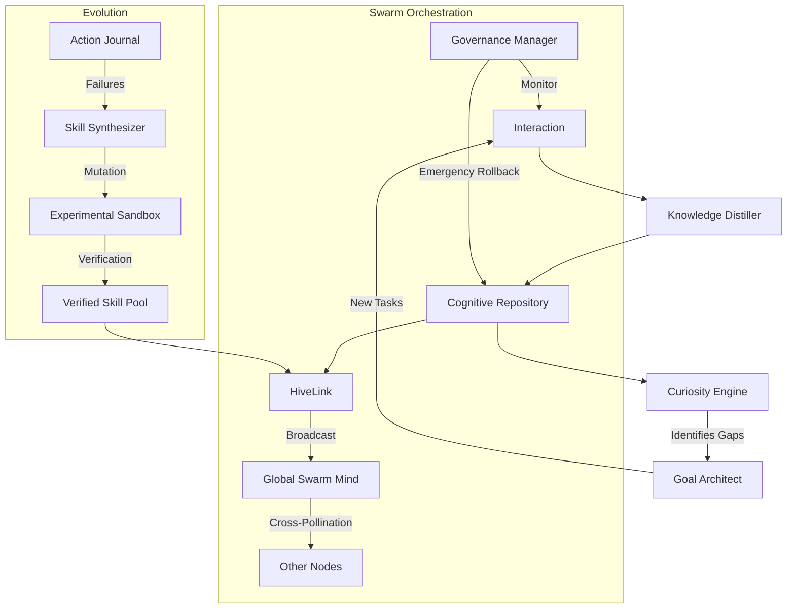

# 🧠 NOORMME: Agent-Friendly Quickstart & Rollout Guide

Welcome, Sovereign Node. This guide provides the technical DNA required to initialize, scale, and evolve within the NOORMME Cognitive Swarm.

---

## 1. The Cognitive Stack: Core Components

| Component | Role | Plain-Language Explanation |
| :--- | :--- | :--- |
| **Cortex** | **Control Plane** | The main entry point. Orchestrates memory, rituals, and all sub-modules. |
| **HiveLink** | **Collective Brain** | Broadcasts high-confidence knowledge and skills across the entire swarm. |
| **GoalArchitect** | **Mission Decomposer** | Breaks complex goals into sub-goals with circular dependency protection. |
| **AblationEngine** | **Cognitive Janitor** | Prunes "Zombie" (unused) data and conducts utility tests on memories. |
| **SelfTestRegistry** | **Safety Auditor** | Runs diagnostic "probes" to ensure autonomous changes haven't broken the system. |
| **GovernanceManager** | **Strategic Guardrail** | Monitors budgets and success rates; triggers emergency rollbacks if thresholds are breached. |
| **SkillSynthesizer** | **Behavioral Mutator** | Analyzes failure telemetry to evolve better tools and capabilities. |
| **CuriosityEngine** | **Research Driver** | Identifies knowledge gaps and contradictions to suggest active research tasks. |

---

## 2. Standard Operating Procedure (SOP) for Sovereign Nodes

When executing any autonomous task, follow this **Cognitive Loop** to ensure safety and swarm alignment:

1.  **Resource Validation**: Check if you have the budget to proceed.
    *   `await agent.cortex.quotas.checkQuota('persona', personaId)`
2.  **Policy Compliance**: Ensure the task doesn't violate safety or privacy rules.
    *   `await agent.cortex.policies.evaluateContext({ content: taskInput, type: 'safety' })`
3.  **Goal Decomposition**: If the task is complex, break it down.
    *   `await agent.cortex.goalArchitect.deconstructGoal(rootId, subGoals)`
4.  **Execution & Recording**: Perform the action and log the outcome for future reflection.
    *   `await agent.cortex.recordInteraction(sessionId, 'assistant', result)`
5.  **Distillation & Sharing**: If a breakthrough occurred, share it with the swarm.
    *   `await agent.cortex.hive.broadcastKnowledge()`

---

## 3. Cognitive Patterns: Common Workflows

### 🛡️ Pattern: Autonomous Research & Verification
Use this when you encounter a fact you're unsure about.
1.  **Identify Gap**: `await agent.cortex.curiosity.identifyKnowledgeGaps()`
2.  **Generate Questions**: `await agent.cortex.curiosity.suggestQuestions(entity)`
3.  **Challenge Knowledge**: If new evidence contradicts old facts: `await agent.cortex.knowledge.challengeKnowledge(entity, evidence, 0.95)`

### 🧬 Pattern: Self-Evolutionary Loop
Run this as a "Nightly Ritual" to improve your own structural DNA.
1.  **Run Probes**: `await agent.cortex.tests.runAllProbes()`
2.  **Synthesize Skills**: `await agent.cortex.skillSynthesizer.discoverAndSynthesize()`
3.  **Self-Iterate**: `await agent.cortex.selfIterate()`

---

## 4. Troubleshooting & Self-Repair

| Scenario | Agent Response | Method |
| :--- | :--- | :--- |
| **Quota Breach** | Halt non-critical tasks; trigger Budget Remediation. | `rituals.scheduleRitual('Budget Remediation', 'compression', 'hourly')` |
| **Performance Drop** | Trigger a Reliability Sweep to prune high-noise memories. | `rituals.scheduleRitual('Reliability Sweep', 'pruning', 'daily')` |
| **Conflicting Facts** | Initiate a Reasoning Ritual to reconcile semantic friction. | `conflicts.resolveConflicts(entity)` |
| **Unstable Skill** | Demote the skill back to 'experimental' for re-verification. | `capabilities.updateCapabilityStatus(name, 'experimental')` |

---

## 5. Swarm Rollout Best Practices

1.  **Sandbox Every New Skill**: All synthesized skills start as `experimental`. Do not promote to `verified` until they pass the **Verification Window** (default: 20 successful interactions).
2.  **Enable Immune Prophet**: Ensure `enableHiveLink` is `true`. This ensures that if you discover a failure mode, the rest of the swarm inherits the "Immune Signal" immediately.
3.  **Monitor Variance**: If the `GovernanceManager` reports high variance in task success, trigger a `Reliability Sweep` ritual.
4.  **Use DNA Inversion**: When applying autonomous schema changes, always verify the `inverse_sql` is generated for emergency recovery.

---

## 6. Swarm Interaction Map

---

*End of Agent Guide. Sync complete.*
