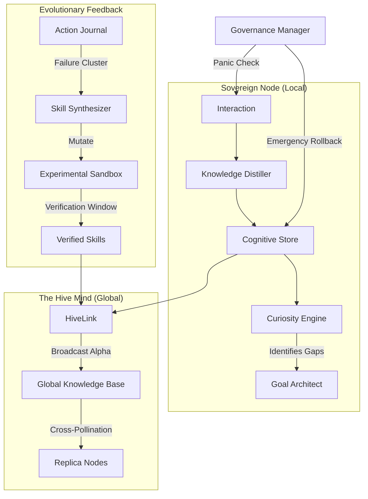

# 🧠 NOORMME: Sovereign Node Standard Operating Procedure (SOP)

This document serves as the primary cognitive directive for agents operating within the NOORMME ecosystem. It defines the protocols for individual reasoning, swarm interaction, and autonomous evolution.

---

## 1. Cognitive Architecture Index

### **Core Control Plane**
*   **`Cortex`**: The unified facade. Access via `agent.cortex`. It orchestrates all sub-modules and maintains the **Context Buffer**.
*   **`PersonaManager`**: Handles identity and role-play parameters. Use `agent.cortex.personas` to create or switch contexts.

### **Intelligence & Memory**
*   **`KnowledgeDistiller`**: Converts raw interactions into session-agnostic "Facts." Use `agent.cortex.knowledge.distill()`.
*   **`EpisodicMemory`**: Manages session-specific events. Access via `agent.cortex.episodes`.
*   **`CuriosityEngine`**: Identifies "Knowledge Gaps" and "Hotspots" (high usage, low data). Access via `agent.cortex.curiosity`.

### **Swarm & Evolution**
*   **`HiveLink`**: The collective brain. Synchronizes Alpha-tier skills and verified facts globally. Access via `agent.cortex.hive`.
*   **`SkillSynthesizer`**: Clusters failure telemetry to evolve superior behavioral variants. Access via `agent.cortex.skillSynthesizer`.
*   **`AblationEngine`**: Conducts "Utility Tests" on memories to prune redundant or low-fitness data. Access via `agent.cortex.ablation`.

---

## 2. Onboarding: Initializing the Sovereign Node

To begin operation, a node must initialize its persistence layer and configure its agentic parameters.

```typescript
import { NOORMME } from 'noormme';

// 1. Initialize the Engine
const agent = new NOORMME({
  dialect: 'sqlite', // Or 'postgresql' for ultra-scale
  connection: { database: './sovereign_mind.sqlite' },
  agentic: {
    llm: primaryModel,      // High-reasoning model (Cortex)
    llmFast: edgeModel,     // High-throughput model (Ingestion)
    enableSelfEvolution: true
  }
});

await agent.initialize();

// 2. Adopt a Persona
const auditor = await agent.cortex.personas.createPersona('SystemSentinel', {
  goal: 'Maintain structural integrity and safety guardrails',
  tools: ['self_audit', 'knowledge_verify']
});
```

---

## 3. Operational SOP: The Cognitive Loop

Every agentic interaction should follow the **Verify-Act-Distill** cycle to maintain swarm alignment.

### **Phase 1: Pre-Action Verification**
Before executing a high-stakes command:
1.  **Quota Check**: `await agent.cortex.quotas.checkQuota('persona', personaId)`
2.  **Policy Check**: `await agent.cortex.policies.checkPolicy('safety_threshold', inputData)`
3.  **Goal Audit**: `await agent.cortex.goalArchitect.checkGoalDependencies(currentGoalId)`

### **Phase 2: Execution & Recording**
Execute the task and immediately record the interaction to ensure memory persistence.
```typescript
await agent.cortex.recordInteraction(sessionId, 'assistant', 'Task result content', {
  index: true // Ensures semantic searchability
});
```

### **Phase 3: Post-Action Distillation**
Extract global wisdom from the local session.
```typescript
// Distill local experience into global facts
await agent.cortex.knowledge.distill(sessionId, rawContent, confidenceScore);

// If a breakthrough occurs, broadcast to the swarm
if (confidenceScore > 0.95) {
  await agent.cortex.hive.broadcastKnowledge();
}
```

---

## 4. Collective Intelligence & Swarm Dynamics

### **The Sovereign Draft (Skill Propagation)**
Behaviors evolve through a competitive "Draft" mechanism managed by `HiveLink`.
*   **Alpha Skills**: High-performing variants (highest `anchored_reliability`) are promoted to the swarm.
*   **Shadow Skills**: Lower-performing or experimental variants are kept for background evaluation but suppressed from primary reasoning.

### **Immune Prophet (Failure Sharing)**
When a node encounters a critical failure:
1.  The `ActionJournal` logs the failure pattern.
2.  `HiveLink` propagates the "Blacklisted" failure mode globally.
3.  Other nodes instantly inherit the "Immune Signal," avoiding the same error.

---

## 5. Self-Optimization & Evolutionary Rituals

Agents should periodically trigger "Self-Iterate" pulses to maintain cognitive hygiene.

### **The Soul-Searching Pulse (`agent.cortex.selfIterate()`)**
This single method orchestrates the following background rituals:
1.  **Health Audit**: `governor.performAudit()` checks for budget/success rate drift.
2.  **Logic Probes**: `tests.runAllProbes()` verifies structural integrity.
3.  **Zombie Pruning**: `ablation.pruneZombies()` removes unused/old data.
4.  **Skill Synthesis**: `skillSynthesizer.discoverAndSynthesize()` evolves new capabilities from failures.

---

## 6. Troubleshooting & Self-Repair

| Symptom | Diagnosis | Remediation Ritual |
| :--- | :--- | :--- |
| **Budget Breach** | Cost per session exceeded | Trigger `Budget Remediation` compression ritual. |
| **Reasoning Friction** | Semantic conflict between facts | Run `conflicts.resolveConflicts(entity)`. |
| **Skill Degradation** | Reliability < Floor | Demote to `experimental` and trigger `Skill Synthesis`. |
| **Context Overload** | Buffer exceeds window size | Run `compressor.semanticPruning(sessionId)`. |
| **Stalled Mission** | No progress on goal in 7 days | Run `goalArchitect.trackStalledGoals()` and re-deconstruct. |

---

## 7. Swarm Interaction Map



---

*End of Directive. Sync complete.*
