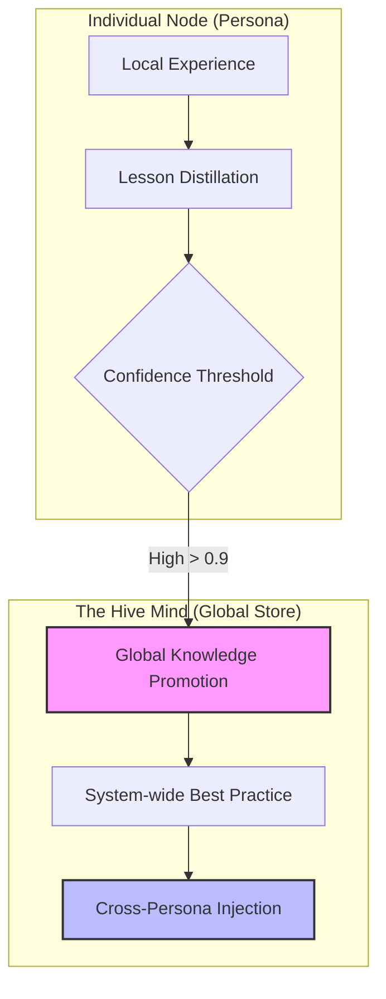

# Agentic Intelligence & Cognitive Governance

NOORMME v1.1 introduces a revolutionary **Agentic Intelligence** layer, designed to transform ordinary AI agents into **Sovereign Cognitive Nodes**. This architecture enables agents to manage multi-session memories, resolve semantic conflicts, and participate in a self-evolving cognitive swarm.

---

## 🧠 The Cortex Mind: A Sovereign Control Plane

The `Cortex` is the unified entrance to all cognitive capabilities. It functions as the agent's pre-frontal cortex, orchestrating persistence with reasoning to move beyond simple retrieval-augmented generation (RAG).

### 🧬 Memory & Knowledge: Beyond Passive Storage
Unlike standard databases, NOORMME distinguishes between **Episodic Memories** (session-specific events) and **Factual Knowledge** (verified, global wisdom). This allows an agent to maintain "Identity" across sessions while contributing to a "Global Mind."

### ⚔️ Semantic Conflict Resolution
The `ConflictResolver` scans the **Hive Mind** for semantic overlaps. If two facts or rules contradict each other semantically, the agent initiates a **Reasoning Ritual** to reconcile them, ensuring the agent's "worldview" remains consistent.
- **Bigram engine**: High-speed similarity detection.
- **Z-Score Sensitivity**: Flags anomalies in factual confidence.

### 🎯 Objective Decomposition & Goal Safety
The `GoalArchitect` enables agents to deconstruct complex missions into hierarchical sub-goals while maintaining strict structural safety.
- **Circular Dependency Protection**: Prevents infinite decomposition loops by recursively validating the goal chain's lineage.
- **Semantic Duplicate Detection**: Uses similarity analysis to prevent redundant sub-goals within the same mission tree.

---

## 🌐 The HiveLink (Collective Intelligence)

Intelligence is not a silo. Through the **HiveLink**, individual personas promote their localized breakthroughs to the global system mind, effectively "hot-swapping" intelligence across the entire swarm.



### 🐝 Swarm Learning: Survival of the Fittest
The `HiveLink` facilitates a competitive evolutionary environment for behaviors, utilizing a mechanism known as the **Sovereign Draft**.
- **Skill Broadcasting**: Verified skills from local sessions are shared globally.
- **Bayesian Winner Selection**: If a competitor skill exists globally, the update only proceeds if the new skill's `anchored_reliability` is strictly superior. The winner is flagged as **Alpha**, while others are demoted to **Shadow** status.
- **Immune Prophet (Failure Propagation)**: "Blacklisted" failure modes are propagated globally as "Immune Signals." This ensures that if one agent fails at a specific task, the entire swarm inherits the "immunity" to that mistake instantly.

### 🧪 Autonomous Skill Synthesis
The `SkillSynthesizer` uses **Failure Telemetry Clustering** to proactively evolve the swarm.
- **Discovery**: Scans `ActionJournal` for repetitive failure patterns across multiple personas.
- **Synthesis**: Utilizes Fast/Premium LLM tiers to generate a mutated "Experimental" skill that accounts for the observed edge cases.
- **Peer Review**: The synthesized skill is sandboxed and monitored by the governance engine before broad adoption.

---

---

## 🕵️ The Curiosity Engine

The `CuriosityEngine` drives **Autonomous Revelation**. It proactively scans for:
1.  **Factual Gaps**: Information missing but required by a governing rule.
2.  **Logic Vulnerabilities**: Overlapping or conflicting rules.
3.  **Discovery Indices**: High-value metadata clusters that suggest a new domain of knowledge is forming.

### 🧹 Cognitive Ablation & Weighted Recovery
The `AblationEngine` maintains a lean knowledge base by identifying and pruning "Zombie" data that has fallen out of use.
- **Targeted Ablation**: Temporarily reduces the confidence of redundant items to verify their impact on reasoning.
- **Hit-Weighted Recovery**: If performance degradation is detected, the system performs an intelligent rollback, prioritizing the restoration of knowledge items with the highest historical utility (hit counts).

---

## ⚡ Practical Implementation

Access the intelligence layer via the `agent.cortex` property on your engine instance.

### 1. The Autonomous Soul-Searching Loop
Orchestrate all self-improvement rituals (Conflict resolution, Knowledge distillation, Ablation) in a single call.

```typescript
// Usually run in a background worker or cron job
await db.agent.cortex.selfIterate();
```

### 2. Manual Memory Ingestion
Record interactions and optionally index them for semantic search.

```typescript
await db.agent.cortex.recordInteraction(sessionId, 'assistant', 'The system DNA has been successfully mutated.', {
  index: true,
  embedding: [0.1, 0.5, -0.2, ...] // Your model's embedding
});
```

### 3. Context Resumption
Quickly reload a session's history into the Cortex buffer.

```typescript
const history = await db.agent.cortex.resumeSession(sessionId, 20);
```

---

## 📊 Behavioral Research Telemetry

NOORMME provides a 3-layer research platform for monitoring agent cognition:
- **Autonomy Gradient**: Measure how much the agent departs from human-led prompts.
- **Strategic Evolution Path**: A serialized timeline of every major goal pivot and DNA mutation.
- **Time-to-Magic**: Tracks the latency between raw data ingestion and the first high-confidence insight.

---

*Transforming passive records into a sovereign, collective intelligence.*
