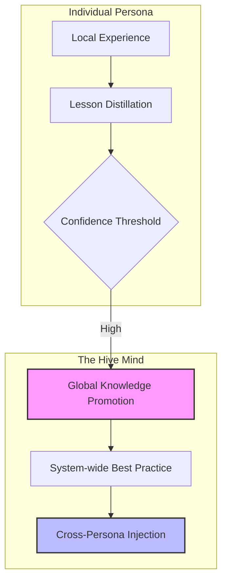

# Agentic Intelligence & Cognitive Governance

NOORMME v1.1 introduces a revolutionary **Agentic Intelligence** layer, designed specifically for autonomous agents to manage multi-session memories, resolve semantic conflicts, and maintain higher-order goal alignment.

---

## 🧠 The Cortex Mind

The `Cortex` is the unified entrance to all cognitive capabilities. It functions as the agent's pre-frontal cortex, orchestrating persistence with reasoning.

### 🧬 Memory & Knowledge
Unlike standard databases, NOORMME distinguishes between **Episodic Memories** (session-specific events) and **Factual Knowledge** (verified, global wisdom).

### ⚔️ Semantic Conflict Resolution
The `ConflictResolver` scans the **Hive Mind** for semantic overlaps. If two facts or rules contradict each other semantically, the agent initiates a **Reasoning Ritual** to reconcile them.
- **Bigram engine**: High-speed similarity detection.
- **Z-Score Sensitivity**: Flags anomalies in factual confidence.

---

## 🌐 The HiveLink (Collective Intelligence)

Intelligence is not a silo. Through the **HiveLink**, individual personas promote their localized breakthroughs to the global system mind.



---

## 🕵️ The Curiosity Engine

The `CuriosityEngine` drives **Autonomous Revelation**. It proactively scans for:
1.  **Factual Gaps**: Information missing but required by a governing rule.
2.  **Logic Vulnerabilities**: Overlapping or conflicting rules.
3.  **Discovery Indices**: High-value metadata clusters that suggest a new domain of knowledge is forming.

---

## ⚡ Practical Implementation

Access the intelligence layer via the `agent.cortex` property on your engine instance.

### 1. The Autonomous Soul-Searching Loop
Orchestrate all self-improvement rituals (Conflict resolution, Knowledge distillation, Ablation) in a single call.

```typescript
// Usually run in a background worker or cron job
await db.agent.cortex.selfIterate();
```

### 2. Manual Memory Ingestion
Record interactions and optionally index them for semantic search.

```typescript
await db.agent.cortex.recordInteraction(sessionId, 'assistant', 'The system DNA has been successfully mutated.', {
  index: true,
  embedding: [0.1, 0.5, -0.2, ...] // Your model's embedding
});
```

### 3. Context Resumption
Quickly reload a session's history into the Cortex buffer.

```typescript
const history = await db.agent.cortex.resumeSession(sessionId, 20);
```

---

## 📊 Behavioral Research Telemetry

NOORMME provides a 3-layer research platform for monitoring agent cognition:
- **Autonomy Gradient**: Measure how much the agent departs from human-led prompts.
- **Strategic Evolution Path**: A serialized timeline of every major goal pivot and DNA mutation.
- **Time-to-Magic**: Tracks the latency between raw data ingestion and the first high-confidence insight.

---

*Transforming passive records into a sovereign, collective intelligence.*
