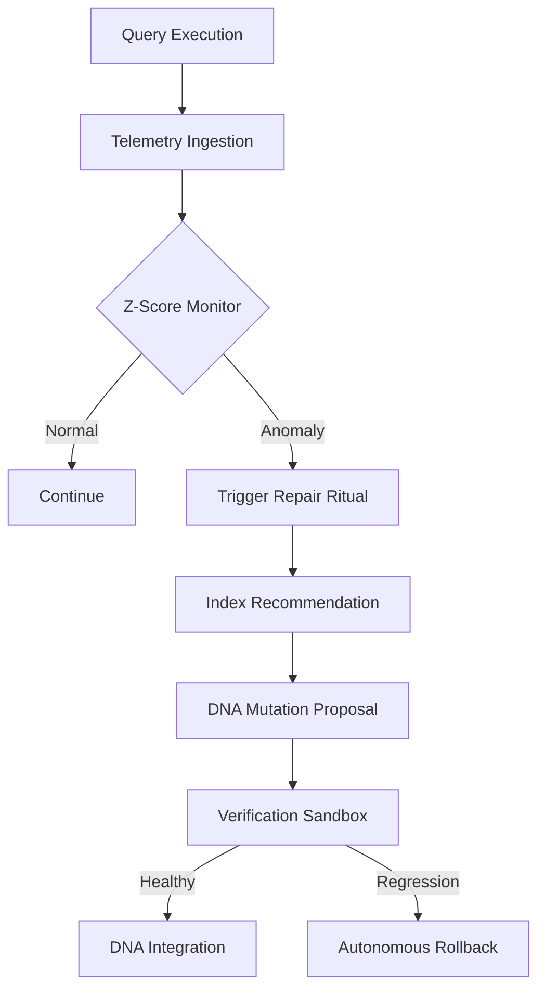

# Autonomous Database Governance

NOORMME's **Autonomous Governance** engine enables agents to manage and heal their own persistence layers without human intervention. By transmuting raw telemetry into structural repairs, NOORMME ensures your system remains performant as its knowledge base grows.

---

## 🏛️ Governance Pillars

The governance engine operates through four specialized layers:

### 1. ⚡ Automatic Persistence Tuning
NOORMME applies high-fidelity SQLite optimizations during initialization to maximize concurrency and throughput.
- **WAL Mode**: 2-3x improvement in concurrent read performance.
- **Advanced Cache**: Intelligent memory utilization (PRAGMA cache_size).
- **Atomic Integrity**: Enforced foreign key support and journaling.

### 2. 🔍 Performance Drift & Logic Probes
The `SelfTestRegistry` monitors for execution regressions and logic violations using a combination of rolling metrics and **Dynamic AI Evaluation**.
- **Z-Score Sensitivity**: Aggregates the mean execution time of the previous 100 queries and triggers a repair if recent sampling exceeds the threshold.
- **Dynamic Logic Probes**: Custom verification scripts (e.g., `audit:check_memory_integrity`) are interpreted by high-reasoning models against real database snapshots to ensure structural integrity across autonomous mutations.

### 3. 🧪 Proactive Structural Evolution
The engine doesn't wait for failure; it uses query metadata to anticipate hotspots.
- **Contextual Analysis**: Identifies knowledge items that require index optimization.
- **DNA Integrity**: Verifies that the physical schema matches the agent's mental model via logic probes.

### 4. 🧘 Background Rituals & The Soul-Searching Loop
The `selfIterate()` method initiates a **Soul-Searching Loop**—a continuous background process that maintains systemic integrity.
- **Audit Health**: Runs the `GovernanceManager` panic checks and executes all `SelfTestRegistry` probes.
- **Ritual Orchestration**: Runs pending rituals like history compression, factual distillation, and zombie pruning.
- **Evolutionary Pulse**: Triggers the `EvolutionaryPilot` to run a self-improvement cycle based on the latest telemetry.

### 5. 🚨 Sovereign Resource Governance
The system enforces real-time financial and resource guardrails via a persistent **Quota Oracle**.
- **Persistent Quota Oracle**: `QuotaManager` enforces strictly weighted cost normalization across multiple currencies (USD, ETH, BTC) using a persistent, synced exchange rate store.
- **Cost Projection**: `ResourceMonitor` performs predictive costing before LLM execution, preventing mid-run budget breaches.
- **Autonomous Containment**: Swarms or personas that exceed their policy-defined quotas are instantly throttled or rolled back to a previous stable DNA configuration.

---

## 🧠 The Governance Loop



---

## ⚡ Practical Telemetry Tracking

The governance engine relies on the `TelemetryOrchestrator` to feed the Z-Score monitor.

### 1. Tracking Cognitive Events
Manual telemetry can be logged to help the engine understand agent state transitions.

```typescript
await db.agent.cortex.telemetry.track(sessionId, 'action', 'Initiating DNA Splice', {
  mutationId: '004_add_logic_probes',
  complexity: 'high'
});
```

### 2. Monitoring Performance Drift
View the system's assessment of its own operational health.

```typescript
const metrics = db.getPerformanceMetrics();
console.log(`Average Query Time: ${metrics.averageQueryTime}ms`);
console.log(`Cache Hit Rate: ${metrics.cacheHitRate * 100}%`);
```

### 3. Running Self-Test Probes
Manually trigger the logic probes that verify DNA integrity.

```typescript
await db.agent.cortex.tests.runAllProbes();
```

---

## 🛠️ Configuration

Tune the governing sensitivity based on your agent's risk appetite:

```typescript
const db = new NOORMME({
  performance: {
    enableAutoOptimization: true,    // Enable governance engine
    enableQueryOptimization: true,   // Deep query analysis
    rollbackThresholdZ: 2.5,        // Sensitivity to drift
    enableRituals: true             // Auto-maintenance
  }
});
```

---

## 📈 Impact Matrix

| Feature | Stability | Throughput | ROI |
| :--- | :--- | :--- | :--- |
| **Pragma Tuning** | High | 2-3x | Instant |
| **Drift Probes** | Critical | Maintenance | Long-term |
| **Rituals** | High | Background | Constant |
| **Proactive Indexing** | Medium | 5-10x | Query-based |

---

*Transforming raw performance metrics into sovereign structural integrity.*
