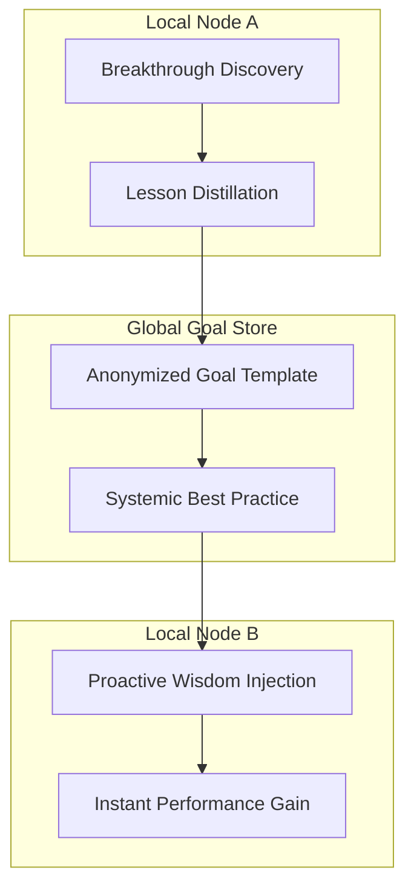

# Goal Cross-Pollination

**Goal Cross-Pollination** is the mechanism through which individual agent breakthroughs are transmuted into systemic, global best practices via the **HiveLink**.

---

## 🧠 Systemic Enlightenment

Intelligence in NOORMME is not siloed. When a specific persona (e.g., "The Auditor") discovers a superior way to interact with a specific persistence pattern, that breakthrough should benefit the entire hive.

### The Pollination Loop

1.  **Insight Capture**: The `KnowledgeDistiller` identifies a high-confidence successful outcome linked to a specific strategic goal.
2.  **DNA Anonymization**: The breakthrough is distilled into its core logic components, stripping away session-specific noise.
3.  **Hive-Mind Promotion**: The distilled lesson is published to the `GlobalGoalStore`.
4.  **Systemic Injection**: Other personas within the hive proactively scan the global store and inject the new "Hivelinked" wisdom into their own reasoning contexts.

---

## 🌐 The Hive Architecture



---

## ⚡ Practical Hive Interaction

Manage the collective wisdom of your agent swarms via the `hive` sub-module.

### 1. Retrieving Cross-Pollinated Goals
View the anonymized breakthroughs promoted by other personas.

```typescript
const globalInsights = await db.agent.cortex.hive.getGlobalInsights();

globalInsights.forEach(insight => {
  console.log(`[Hive Wisdom] ${insight.title}`);
  console.log(`- Strategy: ${insight.anonymizedLogic}`);
  console.log(`- Confidence: ${insight.confidence * 100}%`);
});
```

### 2. Manual Goal Promotion
Force-promote a local breakthrough to the global store for immediate system-wide injection.

```typescript
await db.agent.cortex.hive.promoteToGlobalStore(localGoalId, {
  anonymize: true,
  tags: ['performance', 'optimization']
});
```

---

## 📈 Hive ROI

- **Collective IQ**: The system becomes smarter as a whole, even if individual node counts remain static.
- **Redundancy Elimination**: Persona A no longer needs to repeat the failures of Persona B.
- **Strategic Velocity**: New agents provisioned within the hive inherit the "Global Best Practices" immediately upon initialization.

---

*Synchronizing intelligence across the sovereign hive.*
