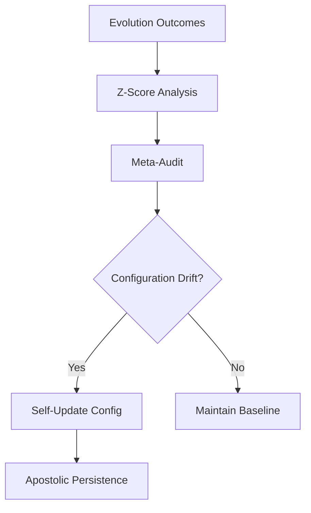

# Sovereign Meta-Evolution

**Sovereign Meta-Evolution** is the system's ability to monitor its own evolutionary strategy and autonomously "self-tune" its performance parameters based on long-term success patterns.

---

## 🧬 Self-Tuning Intelligence

Most AI systems have static configurations. NOORMME has a **Meta-Mind** that views the agent's performance as data.

### 1. Evolutionary Parameter Tuning
The system monitors the success rate of DNA mutations. 
- If the **Regression Rate** is high, the Meta-Evolution engine autonomously lowers the `mutationAggressiveness` threshold.
- If the **Innovation Growth** is stale, it increases the curiosity-driven discovery weight.

### 2. Z-Score Threshold Optimization
The **Governance Engine** doesn't use static thresholds. It learns the "Natural Variance" of your specific infrastructure.
- In a high-latency edge environment (SQLite), the system widens the Z-Score tolerance to prevent "Jitter Rollbacks."
- In a low-latency enterprise environment (Postgres), it tightens the threshold for maximum precision.

---

## 🔄 The Meta-Loop



---

## ⚡ Practical Self-Monitoring

You can monitor the Meta-Evolution engine's performance via the `metrics` sub-module.

### 1. Retrieving Sovereign Metrics
View how the system is currently tuning itself.

```typescript
const stats = await db.agent.cortex.metrics.getEvolutionStats();

console.log(`Mutation Success Rate: ${stats.successRate * 100}%`);
console.log(`Current Aggressiveness: ${stats.parameters.mutationAggressiveness}`);
console.log(`Self-Tuned Z-Threshold: ${stats.parameters.rollbackThresholdZ}`);
```

### 2. Manual Strategic Pivot
Force the Meta-Evolution engine to recalculate its strategy immediately.

```typescript
await db.agent.cortex.strategy.mutateStrategy();
```

---

## 🛠️ Configuration Sovereignty

Meta-evolution can be gated or allowed full autonomy over the agentic settings:

```typescript
const db = new NOORMME({
  agentic: {
    evolution: {
      enableMetaEvolution: true,      // Allow system to tune itself
      metaLearningRate: 0.1,         // Speed of parameter shifting
      maxDriftTolerance: 0.5         // Bound the self-updates
    }
  }
});
```

---

*Empowering the system to architect its own evolutionary destiny.*
