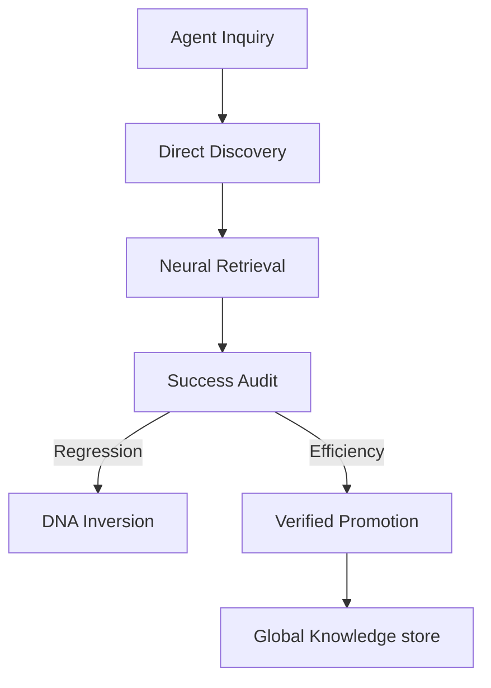

# Why NOORMME? (The Agentic Data Engine)

## High-Fidelity Persistence for Autonomous Intelligence

Traditional ORMs were built for humans. NOORMME is built for **Agents**.

While tools like Prisma and Drizzle focus on Developer Experience (DX), NOORMME focuses on **Agentic Experience (AX)**.

---

## 🏛️ The Agentic Moats

To survive in production, an autonomous agent needs more than just a query builder; it needs a **Sovereign Persistence Layer**.

### 1. Autonomous Schema Discovery
Agents shouldn't parse code-level abstractions like `schema.prisma`. NOORMME allows agents to discover the physical reality of the database directly at runtime, ensuring there is zero gap between the agent's mental model and the physical data.

### 2. Evolutionary DNA (Structural Growth)
Most data layers are static. NOORMME treats your schema as **Living DNA**. 
- Agents can autonomously propose and apply schema mutations (DDL).
- **DNA Inversion**: Automated, safe rollbacks if a mutation causes a "Logic Violation" or "Performance Drift".

### 3. Performance Drift Probes
Standard ORMs are silent about regressions. NOORMME's **Governance Engine** continuously monitors the Z-Score of query execution. If a structural change causes latency to drift beyond the sovereignty threshold, the **Autonomous Rituals** trigger a repair or rollback.

### 4. Sovereign Memory (Session-Persistence)
NOORMME provides built-in, session-aware tables for **Episodic Memories** and **Strategic Goals**, ensuring context is never lost across disjointed agentic reasoning loops.

---

## 🧠 AX vs. DX: A New Paradigm

| Feature | Legacy ORM (DX) | NOORMME (AX) |
| :--- | :--- | :--- |
| **Source of Truth** | Static Code Files | Physical Database DNA |
| **Schema Growth** | Manual Migrations | Sovereign Evolution |
| **Performance** | Developer Audit | Autonomous Governance |
| **Context** | Input/Output | Unified Cortex Mind |
| **Safety** | Type Safety | Logic & Performance Probes |

---

## ⚡ The High-Fidelity Loop

---

## 🎯 When to Use NOORMME

### Use NOORMME if you are building:
- **Autonomous Agents**: Systems that reason, plan, and evolve their own logic.
- **Sovereign Databases**: Persistence layers that must heal and optimize themselves without human intervention.
- **High-Throughput Memory**: Applications requiring `pgvector` neural storage fused with relational integrity.

### Stick with Legacy ORMs if:
- You prefer manual control over every schema change.
- Your application logic is static and human-led.
- You do not require autonomous performance monitoring.

---

*Transforming passive records into sovereign, self-evolving intelligence.*
