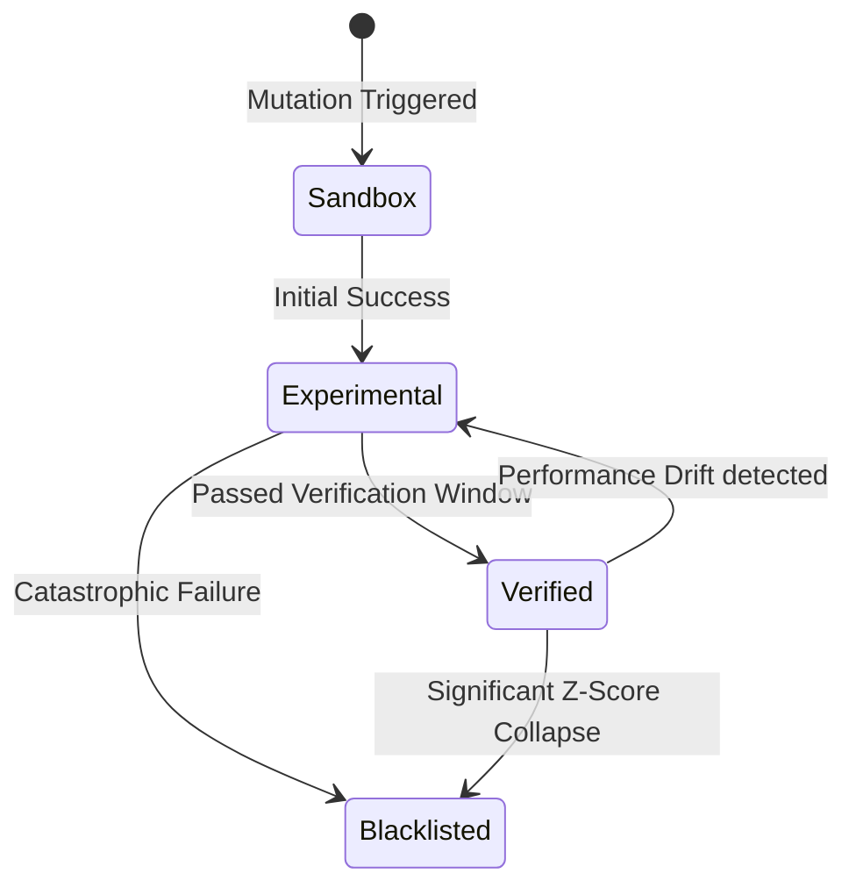

# Skill Lifecycle & Capability Traits

In NOORMME, a **Skill** is an atomic unit of agentic ability, represented by the `AgentCapability` entity. Unlike static functions, skills possess an internal "DNA" that evolves based on historical outcomes.

## 🧬 Capability Traits

Every skill is defined by a set of evolving traits that dictate its reliability and status within the agent's mind.

### 1. `Reliability` (Success Rate)
A moving average of the skill's performance. It is used for **Survival of the Fittest** selection when multiple mutations of the same skill compete for dominance.

### 2. `Status DNA` (The Lifecycle)
A skill's privilege level progresses through four distinct states:
- **`sandbox`**: Newly synthesized, unproven. Restricted use.
- **`experimental`**: Under verification. Performance is actively tracked.
- **`verified`**: Production-grade. The skill has passed the verification window and is now the preferred implementation.
- **`blacklisted`**: Failed early-exit safety checks or continuous performance regression.

### 3. `Version DNA`
Semantic versioning (e.g., `1.0.2`) is automatically incremented with every mutation. The system maintains a lineage, allowing for precise "DNA Rollbacks" if a new version introduces regression.

### 4. `Pre-warming` Trait
A high-potential trait. When the system detects a 90%+ win rate in the `experimental` phase, it pre-synthesizes the "Verified" description, eliminating the transition latency.

## 🔄 The Innovation Loop



## Monitoring Skills

You can programmatically monitor your agent's skill graph:

```typescript
const skills = await db.agentic.getCapabilities('verified');
skills.forEach(skill => {
  console.log(`${skill.name} v${skill.version}: ${skill.reliability * 100}% reliable`);
});
```
