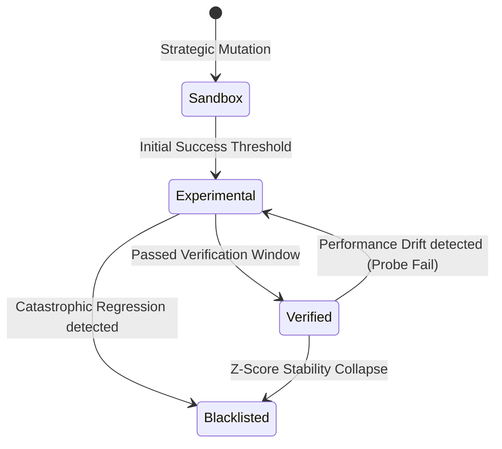

# Skill Lifecycle & Capability DNA

In NOORMME, a **Skill** is an atomic unit of agentic ability, managed via the `AgentCapability` entity. Unlike static functions, skills possess an internal "DNA" that evolves through sequential directed mutation.

---

## 🧬 The Evolution DNA

Every skill is defined by a set of evolving traits that dictate its reliability and status within the agent's mind.

### 1. `Reliability DNA` (Success Rate)
A moving average of performance. This metric is used for **Survival of the Fittest** selection when multiple experimental mutations compete for dominance.

### 2. `Status Hierarchy`
A skill progresses through a verified lifecycle, ensuring only stable logic reaches the core mind:
- **`sandbox`**: Newly synthesized, unproven. Restricted execution.
- **`experimental`**: Under high-fidelity verification. Telemetry is actively tracked.
- **`verified`**: Production-grade. Passed the **Verification Window** and Z-Score stability requirements.
- **`blacklisted`**: Failed early-exit safety checks or showed persistent regression.

---

## 🔄 The Innovation Loop



---

## ⚡ Practical Usage

Manage the evolution of your agent's abilities via `db.agent.cortex.capabilities`.

### 1. Monitoring Architectural Maturity
Retrieve the verified core of the agent's mind in real-time.

```typescript
const skills = await db.agent.cortex.capabilities.getCapabilitiesByStatus('verified');

skills.forEach(skill => {
  console.log(`[Verified] ${skill.name} v${skill.version}`);
  console.log(`- Reliability: ${(skill.reliability * 100).toFixed(2)}%`);
});
```

### 2. Manual Skill Promotion
Force-promote a skill that has passed human-led manual verification.

```typescript
await db.agent.cortex.capabilities.updateCapabilityStatus(skillId, 'verified');
```

### 3. Registering New Potential
Inject a new logic block into the `sandbox` for autonomous verification.

```typescript
await db.agent.cortex.capabilities.registerCapability({
  name: 'SemanticDeduplication',
  description: 'Removes redundant memories using bigram overlap.',
  initialStatus: 'sandbox'
});
```

---

## 🕵️ Governance Impact

> [!IMPORTANT]
> A skill's **Status DNA** can be autonomously downgraded by the **Governance Manager** if `check_performance_drift` fails multiple times in a production context.

---

*Transforming capabilities into sovereign, self-improving intelligence.*
