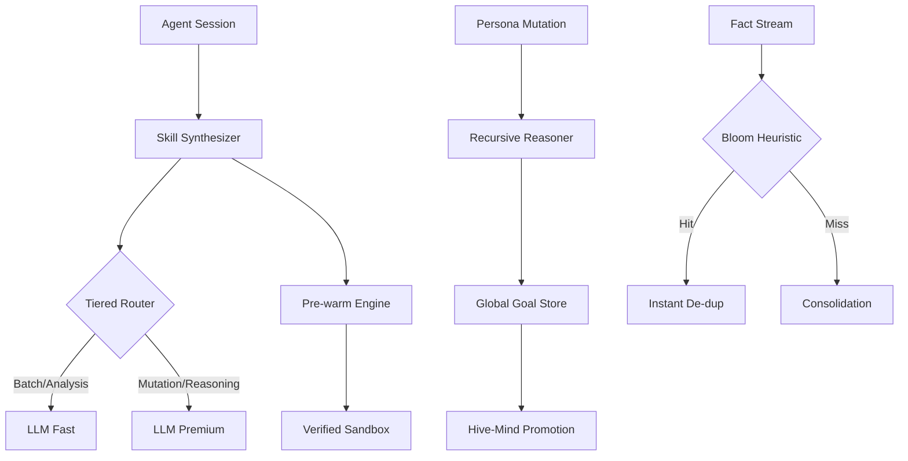

# Ultra-Scale Orchestration

NOORMME Pass 6 introduces the **Ultra-Scale Orchestration** layer, designed to handle massive agentic workloads across distributed environments. This layer transforms individual self-evolution cycles into a systemic, high-throughput intelligence engine.

---

## 🏛️ The Orchestration Pillars

To achieve massive scale, NOORMME decouples reasoning from throughput, utilizing specialized heuristics to eliminate the bottlenecks of traditional persistence.

### 🧠 Performance-Tiered Intelligence
By utilizing **Differentiated Model Routing**, NOORMME optimizes for both cost and latency without sacrificing reasoning depth.
- **Tier 1 (Premium)**: Claude 3.5 Sonnet / GPT-4o for complex DNA mutations and conflict resolution.
- **Tier 2 (Fast)**: GPT-4o-mini / Llama 3 (Groq) for high-frequency fact distillation and routine governance.

### 🔥 Latency Elimination (Pre-warming)
Through **Predictive Pre-warming**, the evolution lifecycle removes the "cold start" period for newly promoted skills.
- The system predicts the success of an experimental skill and begins background optimization (compilation/indexing) before the verification window even closes.

### 🌐 Systemic Hive Learning
Intelligence is no longer siloed. **Goal Cross-Pollination** ensures that a breakthrough in one agent persona becomes a global best-practice for the entire system.
- Successful strategies are anonymized, distilled, and propagated across all active nodes in the hive.

### 🌸 High-Throughput Knowledge
Scalability bottlenecks in consolidated memory are resolved using **Bloom Filter Heuristics**, allowing **100x faster de-duplication** of common fact patterns.

---

## ⚡ Practical Implementation

Access the orchestration layer via the core Cortex modules.

### 1. Global Hive Synchronization
Manually trigger a Hivelink broadcast to promote local insights to the global Neural Storage Layer.

```typescript
// Synchronizes all local verified breakthroughs with the Hive Mind
await db.agent.cortex.hive.broadcastKnowledge();
```

### 2. High-Throughput Fact Ingestion
Use the Bloom Filter Proxy to rapidly ingest millions of facts without semantic search overhead.

```typescript
await db.agent.cortex.knowledge.distill('Event Data', 'High-volume sensor log...', 0.99, {
  enableBloomHeuristic: true
});
```

### 3. Predictive Optimization
Check the pre-warming status of skills nearing production readiness.

```typescript
const preWarmed = await db.agent.cortex.capabilities.getPreWarmedSkills();
console.log(`Ready for Instant Promotion: ${preWarmed.length} skills`);
```

---

## 📐 Architectural Tiers

| Layer | Focus | Mechanism | Scaling |
| :--- | :--- | :--- | :--- |
| **Orchestrator** | Coordination | Differentiated Routing | 1,000+ Agents |
| **Evolutionary** | Innovation | DNA Inversion / Mutation | Sequential |
| **Cognitive** | Reasoning | Bigram/Semantic Search | Concurrent |
| **Ingestion** | Throughput | Bloom Filter Heuristics | Transactional |

---

## 🧠 Systemic Flow



---

*For more details on semantic optimization, see [Knowledge Heuristics](./knowledge-heuristics.md).*

---

*Empowering systemic intelligence through ultra-scale persistence.*
