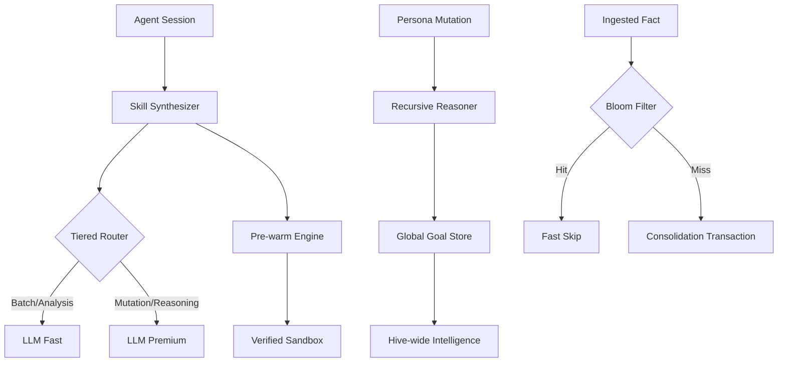

# Ultra-Scale Orchestration

NOORMME Pass 6 introduces the **Ultra-Scale Orchestration** layer, designed to handle massive agentic workloads across distributed environments. This layer transforms individual self-evolution cycles into a systemic, high-throughput intelligence engine.

## Core Pillars

### 🧠 Performance-Tiered Intelligence
The system no longer treats all AI tasks as equal. By utilizing **Differentiated Model Routing**, NOORMME optimizes for both cost and latency without sacrificing reasoning depth.
- [Tiered Routing Guide](./tiered-routing.md)

### 🔥 Latency Elimination
Through **Predictive Pre-warming**, the evolution lifecycle removes the "cold start" period for newly promoted skills. The system predicts success and optimizes in parallel.
- [Predictive Pre-warming Guide](./predictive-pre-warming.md)

### 🌐 Systemic Hive Learning
Intelligence is no longer siloed. **Goal Cross-Pollination** ensures that a breakthrough in one agent persona becomes a global best-practice for the entire system.
- [Goal Cross-Pollination Guide](./goal-cross-pollination.md)

### 🌸 High-Throughput Knowledge
Scalability bottlenecks in consolidated memory are resolved using **Bloom Filter Heuristics**, allowing 100x faster de-duplication of common fact patterns.
- [Knowledge Heuristics Guide](./knowledge-heuristics.md)

## Architecture Diagram

