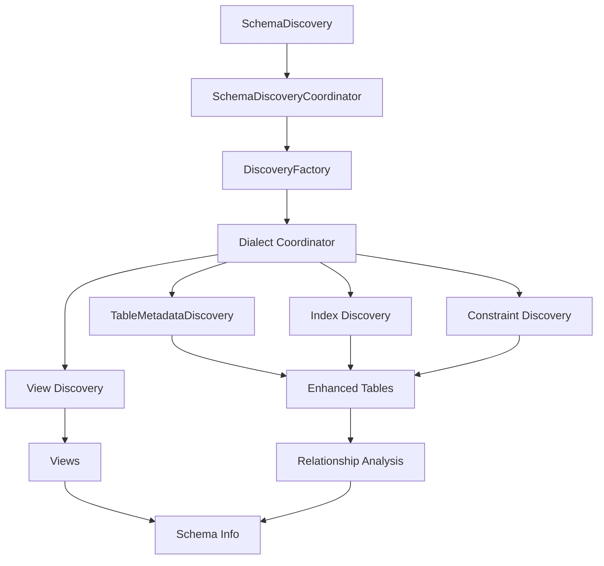

# Schema Discovery Architecture Design

## Design Goals

1. **Modularity**: Separate concerns into focused, single-responsibility modules
2. **Extensibility**: Easy addition of new database dialects without modifying existing code
3. **Performance**: Database-specific optimizations and native query usage
4. **Maintainability**: Clear separation between generic and dialect-specific logic
5. **Type Safety**: Comprehensive TypeScript support with proper interfaces

## Architectural Patterns

### 1. Factory Pattern

The `DiscoveryFactory` implements the Factory pattern to create dialect-specific services:

```typescript
class DiscoveryFactory {
  createDiscoveryCoordinator(dialect: string): DialectCoordinator
  createIndexDiscovery(dialect: string): IndexDiscovery
  createConstraintDiscovery(dialect: string): ConstraintDiscovery
}
```

**Benefits:**
- Encapsulates object creation logic
- Makes adding new dialects simple
- Provides consistent interface across dialects
- Enables dependency injection

### 2. Strategy Pattern

Each dialect implements its own strategy for schema discovery:

```typescript
interface DiscoveryStrategy {
  discoverSchema(db: Kysely, config: Config): Promise<SchemaInfo>
  getCapabilities(): DatabaseCapabilities
  getRecommendations(db: Kysely, tables: TableInfo[]): Promise<string[]>
}
```

**Benefits:**
- Runtime selection of discovery algorithm
- Easy to add new strategies
- Maintains consistent interface
- Enables A/B testing of discovery methods

### 3. Singleton Pattern

Coordinators and factories use the Singleton pattern for:
- Resource management
- Consistent state across application
- Performance optimization (no repeated instantiation)

```typescript
class PostgreSQLDiscoveryCoordinator {
  private static instance: PostgreSQLDiscoveryCoordinator
  
  static getInstance(): PostgreSQLDiscoveryCoordinator {
    if (!PostgreSQLDiscoveryCoordinator.instance) {
      PostgreSQLDiscoveryCoordinator.instance = new PostgreSQLDiscoveryCoordinator()
    }
    return PostgreSQLDiscoveryCoordinator.instance
  }
}
```

## Component Responsibilities

### Core Layer

#### SchemaDiscoveryCoordinator
- **Purpose**: Central coordination point for schema discovery
- **Responsibilities**:
  - Determine dialect from database connection
  - Delegate to dialect-specific coordinator
  - Handle error scenarios
  - Provide unified interface

#### DiscoveryFactory
- **Purpose**: Create dialect-specific services
- **Responsibilities**:
  - Service instantiation
  - Dependency management
  - Capability reporting
  - Dialect validation

#### Generic Discovery Services
- **TableMetadataDiscovery**: Cross-dialect table structure discovery
- **RelationshipDiscovery**: Foreign key relationship analysis
- **ViewDiscovery**: Database view discovery

### Dialect Layer

#### Dialect Coordinators
Each database dialect has its own coordinator that:
- Orchestrates discovery process
- Enhances generic metadata with dialect-specific information
- Provides database-specific recommendations
- Handles dialect-specific error scenarios

#### Specialized Services
- **Index Discovery**: Native index analysis using database-specific queries
- **Constraint Discovery**: Constraint analysis with dialect-specific features
- **Introspection**: Advanced metadata retrieval using system tables/views

#### Builders
- **Table Builders**: Dialect-specific table creation with native features
- **Index Builders**: Database-specific index creation
- **Constraint Builders**: Native constraint implementation

## Data Flow



## Database-Specific Implementations

### PostgreSQL Implementation

**System Tables Used:**
- `pg_tables`: Table metadata
- `pg_index`: Index information
- `pg_constraint`: Constraint details
- `pg_class`: Object metadata
- `pg_stat_*`: Performance statistics

**Features:**
- Deferred constraints
- Partial indexes
- Expression indexes
- JSONB support
- Array types
- Custom types
- Extensions

**Query Example:**
```sql
SELECT 
  ic.relname as name,
  i.indisunique as unique,
  array_agg(a.attname ORDER BY array_position(i.indkey, a.attnum)) as columns
FROM pg_index i
JOIN pg_class ic ON i.indexrelid = ic.oid
JOIN pg_attribute a ON a.attrelid = i.indrelid AND a.attnum = ANY(i.indkey)
WHERE i.indrelid = $1
GROUP BY ic.relname, i.indisunique
```

### SQLite Implementation

**System Resources:**
- `sqlite_master`: Schema metadata
- `PRAGMA` commands: Configuration and metadata
- `sqlite_version()`: Version information

**Features:**
- Foreign key constraints (when enabled)
- Partial indexes
- Expression indexes
- WAL mode
- Auto-increment columns
- WITHOUT ROWID tables

**Query Example:**
```sql
SELECT name, sql 
FROM sqlite_master 
WHERE type = 'index' AND tbl_name = ?
```

## Performance Considerations

### Parallel Processing
- Table metadata discovery runs in parallel for multiple tables
- Index and constraint discovery parallelized per table
- Relationship analysis processes all tables concurrently

### Caching Strategy
- Singleton instances prevent repeated instantiation
- Metadata caching at coordinator level
- Lazy loading of expensive operations

### Database-Specific Optimizations
- **PostgreSQL**: Uses prepared statements and connection pooling
- **SQLite**: Leverages PRAGMA optimizations and WAL mode
- **Future**: Connection pooling and prepared statements for other dialects

## Error Handling Strategy

### Graceful Degradation
- Individual table discovery failures don't stop entire process
- Missing metadata is logged but doesn't cause failures
- Fallback to generic discovery when dialect-specific fails

### Error Classification
- **Connection Errors**: Retry with exponential backoff
- **Permission Errors**: Log warning, continue with available data
- **Syntax Errors**: Log error, fallback to generic queries
- **Timeout Errors**: Increase timeout, retry once

### Logging Strategy
- Structured logging with context
- Different log levels for different error types
- Performance metrics for optimization

## Testing Strategy

### Unit Tests
- Individual service testing
- Mock database responses
- Error scenario testing

### Integration Tests
- Real database connections
- Full discovery workflow testing
- Performance benchmarking

### Dialect-Specific Tests
- Database-specific feature testing
- Native query validation
- Capability verification

## Future Enhancements

### Planned Features
1. **MySQL Dialect**: Full MySQL implementation
2. **MSSQL Dialect**: SQL Server support
3. **Caching Layer**: Redis/Memory caching for metadata
4. **Schema Comparison**: Diff tools for schema changes
5. **Migration Tools**: Automatic migration generation

### Performance Improvements
1. **Connection Pooling**: Optimize database connections
2. **Query Optimization**: Reduce query count and complexity
3. **Parallel Processing**: Enhanced concurrency
4. **Memory Management**: Optimize memory usage for large schemas

### Monitoring and Analytics
1. **Performance Metrics**: Discovery time tracking
2. **Usage Analytics**: Feature usage statistics
3. **Health Checks**: Database connection monitoring
4. **Alerting**: Performance degradation alerts
