# Schema Discovery Architecture Diagram

## High-Level Architecture

## Data Flow Diagram

## Component Relationships

```mermaid
classDiagram
    class SchemaDiscovery {
        -coordinator: SchemaDiscoveryCoordinator
        +discoverSchema() SchemaInfo
        +getCoordinator() SchemaDiscoveryCoordinator
    }
    
    class SchemaDiscoveryCoordinator {
        -factory: DiscoveryFactory
        -currentDialect: string
        +discoverSchema() SchemaInfo
        +getFactory() DiscoveryFactory
        +getCurrentDialect() string
    }
    
    class DiscoveryFactory {
        +createDiscoveryCoordinator(dialect) DialectCoordinator
        +createTableDiscovery() TableMetadataDiscovery
        +createIndexDiscovery(dialect) IndexDiscovery
        +getSupportedDialects() string[]
        +isDialectSupported(dialect) boolean
    }
    
    class PostgreSQLDiscoveryCoordinator {
        -tableDiscovery: TableMetadataDiscovery
        -indexDiscovery: PostgreSQLIndexDiscovery
        -constraintDiscovery: PostgreSQLConstraintDiscovery
        +discoverSchema() SchemaInfo
        +getCapabilities() PostgreSQLCapabilities
        +getRecommendations() string[]
    }
    
    class SQLiteDiscoveryCoordinator {
        -tableDiscovery: TableMetadataDiscovery
        -indexDiscovery: SQLiteIndexDiscovery
        -constraintDiscovery: SQLiteConstraintDiscovery
        +discoverSchema() SchemaInfo
        +getCapabilities() SQLiteCapabilities
        +getRecommendations() string[]
    }
    
    class TableMetadataDiscovery {
        +discoverTables() TableInfo[]
        +getTableStatistics() any
        +validateTableStructure() ValidationResult
    }
    
    class PostgreSQLIndexDiscovery {
        +discoverTableIndexes() PostgreSQLIndexInfo[]
        +getIndexUsageStats() IndexUsageStats[]
        +analyzeIndexEfficiency() IndexAnalysis
    }
    
    class SQLiteIndexDiscovery {
        +discoverTableIndexes() SQLiteIndexInfo[]
        +getIndexInfo() any[]
        +analyzeIndexEfficiency() IndexAnalysis
        +getTableSize() TableSizeInfo
    }
    
    SchemaDiscovery --> SchemaDiscoveryCoordinator
    SchemaDiscoveryCoordinator --> DiscoveryFactory
    DiscoveryFactory --> PostgreSQLDiscoveryCoordinator
    DiscoveryFactory --> SQLiteDiscoveryCoordinator
    PostgreSQLDiscoveryCoordinator --> TableMetadataDiscovery
    PostgreSQLDiscoveryCoordinator --> PostgreSQLIndexDiscovery
    SQLiteDiscoveryCoordinator --> TableMetadataDiscovery
    SQLiteDiscoveryCoordinator --> SQLiteIndexDiscovery
```

## Database-Specific Features

## Performance Optimization Flow

## Error Handling Flow

## Migration Path

## Testing Strategy

This architecture diagram shows the complete structure of the new factory/dialect-based schema discovery system, including data flow, component relationships, database-specific features, performance optimizations, error handling, migration path, and testing strategy.
